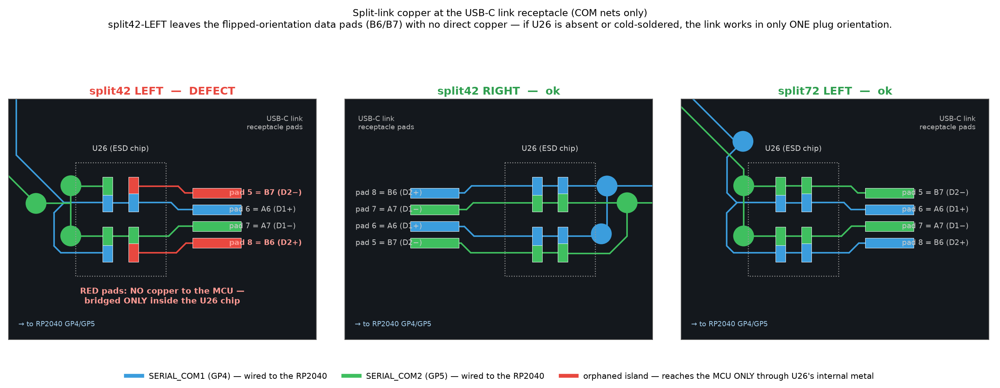
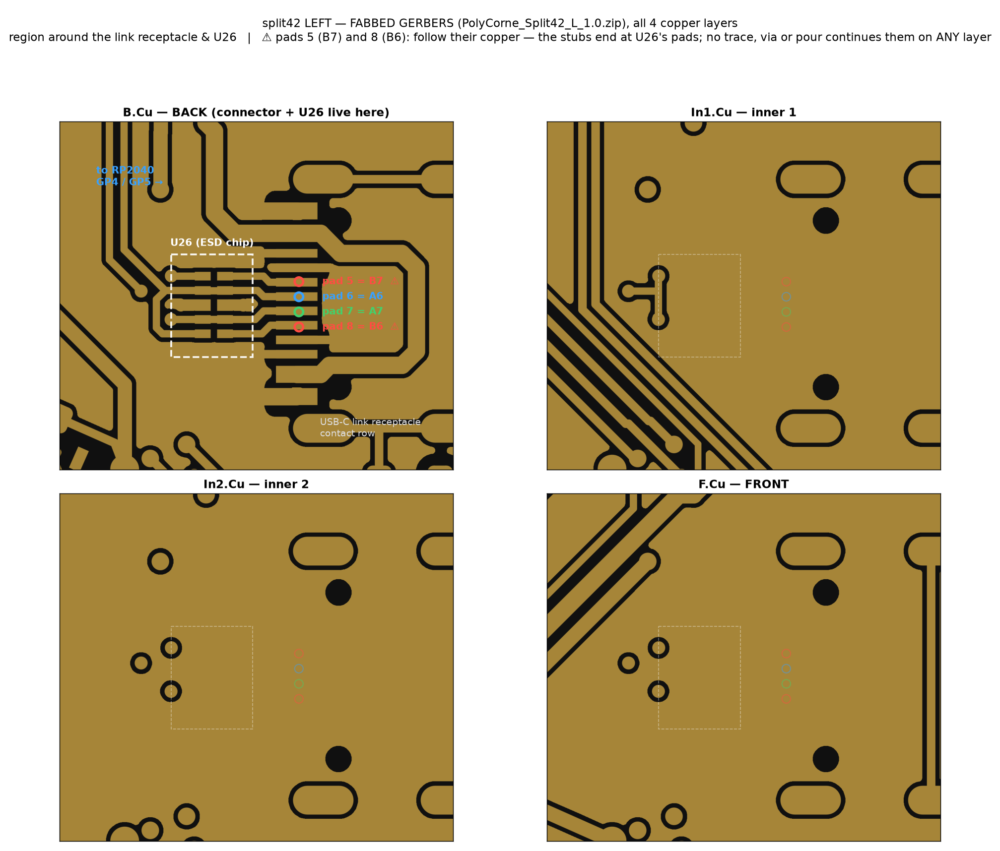

# split42 split-link status — RESTART (2026-07-15 evening)

Fresh, disciplined tracking of what actually works on real split42 hardware. Started
over because the investigation had drifted into firmware theory-chasing while the
decisive evidence points the other way (see below). **One row per real hardware test.
Record the build banner verbatim + the master side + the result. No conclusions from a
single boot** (the same firmware has produced different results on different boots).

## ⚠️ PIVOTAL FINDING — the firmware is (almost certainly) NOT the variable

**Known-good firmware that worked earlier the SAME day now fails.**
- `5de77192` (FW 0.9.51) — confirmed **"this works indeed"** earlier this session →
  now **fails on both sides** (user rebuilt + a fresh build from here).
- `9253a328` (merge of #144 *split42-working-all-subsystems*, the real-Cirque
  confirmed-working config) — user rebuilt → **also fails now**.

When a *constant* (a fixed commit) changes behaviour between the morning and the
evening, the variable is not in that constant. ⇒ **Suspect the physical layer**, not
the firmware:
- The split link counter reads `crc_err=0 transport_fail=100%` → **no bytes cross the
  inter-half UART at all** (not corruption — total silence). That is the signature of a
  broken physical link (cable / connector / GP4-GP5 solder), not a firmware bug.
- `transport_connected=1` in the boot banner is a red herring: it is the flag's value at
  the single instant the one-shot banner prints, before the main loop starts; it reads 1
  even in runs that then log 100% transport_fail.

**What is already ruled out as the cause (this session):**
- Master side (left vs right) — fails on **both**.
- Build environment — the **same source fails whether the user or I compile it**.
- The boot splash (progressive vs blocking) — `b5bcf07a SPLASH=blocking` still fails.
- The RX pre-poll / dead-IRQ "master receive" theory — a no-delay + pre-poll build
  fails at the handshake (`transport_fail=100%`); and the working restore needed no
  pre-poll at all. (Full write-up in the top-level CLAUDE.md.)
- Handedness — user confirms correct side on the key displays.
- split72 — works with its cable (but NOTE: this validates split72's cable, **not**
  necessarily split42's inter-half cable — see the diagnostics).

## Established facts (hardware)
- split72 works.
- split42 handedness (EE_HANDS) resolves correctly (key-display legends confirm).
- Every failing split42 run shows `crc_err=0 transport_fail=100%` — zero bytes across
  the split UART (GP4 RX / GP5 TX, full-duplex, straight cable, crossover by role via
  `SERIAL_USART_PIN_SWAP`).

## Self-describing builds
Every diag build from 0.9.62+ prints a banner second line — record it verbatim:
```
build: <git-hash> | SPLIT_POINTING=<0/1> RX_PREPOLL=<us> BOOT_DELAY=<ms> SPLASH=<progressive|blocking>
```
(0.9.51 builds like `5de77192` have NO banner line — full-logo splash, that's how you
know it's the genuine old one.)

## Test log — one row per real hardware boot

| # | when | build / commit | FW | pointing | delay | splash | prepoll | USB side | RESULT | notes |
|---|------|----------------|----|----------|-------|--------|---------|----------|--------|-------|
| 1 | 07-15 AM | `5de77192` (KNOWN-GOOD) | 0.9.51 | custom | 400 | blocking | no | ? | ✅ WORKS | "this works indeed" |
| 2 | 07-15 AM | restore `27de2637` (=PR#151) | 0.9.61 | custom | 400 | progressive | no | ? | ✅ WORKS | "it works" |
| 3 | 07-15 PM | `a9e3b1e3` | 0.9.62 | custom | 400 | progressive | no | right, then left | ❌ FAIL | both sides |
| 4 | 07-15 PM | `2a08a7bb` default branch (my build) | 0.9.63 | custom | 400 | progressive | no | left | ❌ FAIL | |
| 5 | 07-15 PM | `2a08a7bb` default branch (user build) | 0.9.63 | custom | 400 | progressive | no | ? | ❌ FAIL | |
| 6 | 07-15 PM | pre-poll `87f15bec` | 0.9.61 | custom | **0** | progressive | **3000us** | ? | ❌ FAIL | expected (no delay) |
| 7 | 07-15 PM | `b5bcf07a` | 0.9.63 | custom | 400 | **blocking** | no | right | ❌ FAIL | user's splash hypothesis — refuted |
| 8 | 07-15 PM | `5de77192` (KNOWN-GOOD, rebuilt) | 0.9.51 | custom | 400 | blocking | no | both | ❌ **FAIL** | **worked in AM, fails now** |
| 9 | 07-15 PM | `9253a328` (#144, real Cirque) | 0.9.5x | cirque_i2c | 400 | blocking | no | ? | ❌ **FAIL** | was confirmed working; fails now |
| 10 | 07-15 PM | `981e5158` EEPROM-diag | 0.9.63 | custom | 400 | progressive | no | right & left | ❌ FAIL | **EEPROM CLEAN on both halves** — see below |
| 11 | 07-16 eve | `7ddc2f49` RX-line probe | 0.9.63 | custom | 400 | progressive | no | **left & right, HOST QUIT, qmk console** | ❌ FAIL | **`rx_bytes=0 rx_clr=0` BOTH orientations** — see below |

### Row 11 — ZERO bytes reach the master's RX, either orientation (2026-07-16)
Clean test (PolyKybdHost quit, `qmk console` only). Both sides identical:
```
Split link: 201 tx crc_err=0 transport_fail=201 giveup=67 err=100.0% rx_bytes=0 rx_clr=0
eeprom: clean on both halves again (hands correct, no stall, no reformat)
```
- **Not one byte ever entered the master's RX FIFO** across 201 transactions, from
  either side. This is the wire-dead signature, not a wake/IRQ problem (nothing to
  wake for) and not host interference (host was off; result unchanged).
- The slave half boots + renders while powered only via the split cable ⇒ the cable's
  **power conductors are fine**; the failure is specifically the **data path**.
- Remaining candidates: the GP4 conductor/joints (master→slave direction — the master
  always TXs on GP4 via the swap), the GP5 conductor/joints (slave→master echo path —
  the slave always TXs on GP5), a dead pad/pin on one half, or the slave never
  transmitting. The next probe (below) splits these without instruments.

### Row 10 — EEPROM ruled out (2026-07-15 ~21:50)
Both halves read out healthy and consistent; EEPROM is **not** the cause:
```
right: eeprom: hands_en=1 hands_raw=0 hands_ms=0 post_en=1 load_ms=0 init_ran=0 bright=50 lang=0   (+ "USER_SYNC_POLY_DATA failed to send")
left:  eeprom: hands_en=1 hands_raw=1 hands_ms=0 post_en=1 load_ms=0 init_ran=0 bright=50 lang=0
```
- `hands_en=1` / `post_en=1` both → eeconfig valid on both halves.
- `hands_raw`: right=0 (right side), left=1 (left side) → **handedness correct on both**.
- `hands_ms=0`, `load_ms=0` → **no blocking wear-leveling consolidation** at boot.
- `init_ran=0` → EEPROM was valid, NOT reformatted this boot.
- `bright=50 lang=0` identical on both → no EEPROM divergence.
⇒ The EEPROM/wear-leveling hypothesis is dead. Nothing persistent-in-software is
wrong. The master still logs `USER_SYNC_POLY_DATA failed to send` = the split bridge
gets no response (consistent with the `transport_fail=100%` earlier).

**The jump from rows 1–2 (works, AM) to rows 3–9 (fail, PM) with overlapping/identical
firmware is the whole story: something changed on the bench between AM and PM.**

## Next: physical-layer diagnostics (hold firmware constant at a known-good build)

Run these with the **known-good `5de77192`** flashed to both halves, changing ONE
physical thing at a time and logging a row above for each:

1. **Swap the inter-half split cable.** Use the *exact* cable that works between the
   split72 halves on split42 (or a known-good spare). transport_fail=100% is textbook
   bad-cable/bad-connector. This is the #1 suspect and the cheapest test.
2. **Reseat / inspect the split42 inter-half connector** (both ends). Look for a cracked
   solder joint on the TRRS/JST and on GP4/GP5 at each RP2040.
3. **Continuity + wiggle test** GP4↔GP4 and GP5↔GP5 end-to-end across the cable while
   flexing it (an intermittent open reads as transport_fail=100%).
4. **Try each half alone as master into a scope/LA on GP5 (TX):** power one half as USB
   master and watch GP5 — does it drive the ~230400-baud handshake frames? Then the
   other half. Isolates a dead TX PIO on one half from a cable fault.
5. **Swap which physical half is which** (if mechanically possible) to see if the fault
   follows a half or the cable.

If a cable swap or reseat brings `5de77192` back to ✅, the firmware chase is over — it
was a degrading physical connection all along, and rows 3–9 were all the same cable
fault, not the configs we were varying.

## Re-analysis with fresh eyes (2026-07-16, pre-probe) — three overlooked things

A from-scratch re-read of the whole investigation, verifying the load-bearing claims
against the code instead of against earlier conclusions. Three findings, one big.

### 1. The "dead RX IRQ" was a MEASUREMENT ARTIFACT (observer effect)

The cornerstone claim — "the PIO rx-not-empty IRQ never fires, even in a working
link (`irq_rxne≈0`)" — does not survive a code read. In `sync_rx()`
(`serial_vendor.c`) the RXNEMPTY interrupt source is **only enabled inside the
FIFO-empty loop**:

```c
while (pio_sm_is_rx_fifo_empty(...)) {
    pio_set_irq0_source_enabled(..., true);   // <-- only reached if FIFO empty at check
    osalThreadSuspendTimeoutS(...);
}
```

If the byte is **already in the FIFO** when `sync_rx` is called — which the working-era
diag runs themselves reported ("poll never entered (byte always present)",
`poll_hits=84658`) — the IRQ source is **never enabled**, so it never fires, so
`irq_rxne` reads ~0 **in a perfectly healthy system**. And the diag pre-poll made this
worse: it deliberately waited for the byte *before* the locked check, guaranteeing the
IRQ was never needed. In broken runs `irq_rxne=0` simply because **no bytes ever
arrived** (nothing to interrupt about). Either way, `irq_rxne≈0` proved nothing.

**Decisive counter-evidence that the IRQ path actually works:** the morning restore
build (row 2) had **no pre-poll at all** and worked. With a genuinely dead IRQ, every
first-byte wait would have suspended into the 20 ms timeout and the link could never
have functioned. It did. ⇒ The IRQ wakes fine when bytes arrive. The entire
"dead-IRQ blocking-receive trap" root-cause chain in SPLIT42_LINK_INVESTIGATION.md is
built on this artifact and is hereby superseded.

### 2. Permanent 100 % transport_fail is INCOMPATIBLE with every timing/boot-order theory

Verified in `split_util.c`/`transactions.c`: after `SPLIT_MAX_CONNECTION_ERRORS` the
master does NOT stop — it keeps probing (reduced cadence, `num_retries` drops 10→1,
`SPLIT_CONNECTION_CHECK_TIMEOUT` backoff) and a single success resets
`connection_errors` to 0. The slave's main loop demonstrably runs (keypress inversion).
So ANY theory of the form "the halves missed each other at boot" (delay, splash churn,
slow slave, busy master) predicts **eventual recovery** — the master offers a
handshake ~forever and a live slave eventually answers one. We observe 1005+/1005
failures over minutes, repeatedly. ⇒ The failure is **structural** for the whole
session: the id byte doesn't reach the slave, or the echo doesn't reach the master.
Bytes are simply not crossing.

### 3. The pointing "fix" had an unexamined hole: POINTING_DEVICE_RIGHT + orientation

Verified in `quantum/split_common/transactions.c` `pointing_handlers_master()`: with
`POINTING_DEVICE_RIGHT`, **if the master is the right half it returns immediately — no
pointing transaction at all**. The extra "healing" split traffic only exists when the
**left** half is master. No working-era test recorded which half was USB master (the
banner didn't exist yet). So the pointing hypothesis was only ever coherent for
left-master boots, and was never actually tested against orientation.

### The synthesis (hypothesis, to be tested — not a conclusion)

One mechanism explains EVERY row of this table plus the entire historical bisect:
**a marginal physical inter-half contact (TRRS jack / solder joint on GP4/GP5) whose
state flips across replug/flash handling cycles.** Every firmware test involved
physical handling (bootloader replug, cable flex). A contact lottery:
- mints false bisect signals (pointing "needed", delay "needed" — whichever build was
  in hand when the contact happened to seat),
- explains why NO software mechanism was ever found (traffic/count/shmem/linkage/
  layout/EEPROM all individually refuted — because there isn't one),
- explains morning-works → evening-fails on identical firmware (contact finally went
  fully open mid-day, after dozens of handling cycles),
- explains the symmetric failure (either conductor open kills both orientations:
  master TXs on GP4 and RXs on GP5 regardless of which half is master),
- survives every reflash and a clean EEPROM.

### What tonight's RX probe (`7ddc2f49`) actually discriminates — THREE ways

This build has **no pre-poll**, so the IRQ path runs un-observed for the first time
while the counters watch the FIFO independently:
- **`rx_bytes=0 rx_clr=0`** while tx climbs → nothing arrives → **wire/contact open**
  (hardware). Next: the slave-blink probe below to localize the direction/conductor.
- **`rx_clr` climbing** (bytes arrive but land in the *next* transaction's clear) →
  bytes DO arrive but the suspend never woke → **the first real evidence of a broken
  IRQ path** (this time without the observer effect). Firmware angle reopens.
- **`rx_bytes≈tx`, failures low** → it works (the contact re-seated — also
  informative: marginal, not open).

### Prepared next step if rx=0: the slave-blink probe (no console needed on the slave)

A build where the slave visibly flashes its keycap displays on ANY received byte.
Plug USB into the left half, watch the right: flashing = master→slave conductor alive
(the cut is the echo path); dark = master→slave conductor dead. Localizes the broken
direction with zero instruments.

### Bench answers (2026-07-16, user) — two questions closed

1. **Orientation: works-era builds worked on BOTH sides.** The user routinely swapped
   the USB side on working AND failing builds. Since a right-master boot has **zero**
   pointing split traffic (§3), a build that worked in both orientations cannot have
   been fixed by pointing traffic. ⇒ **The pointing-traffic mechanism is now
   definitively dead** (the user had independently suspected POINTING_DEVICE_RIGHT).
   Whatever `SPLIT_POINTING_ENABLE` correlated with, it was not the transactions.
2. **PolyKybdHost was ALWAYS running (it autostarts) — in every test, works and
   fails.** Consequences:
   - As a *constant* it is not the morning→evening flip variable by itself, BUT the
     **one-time first successful P11 connect (the morning restore) would have kicked
     the silent font-pack auto-flash** — ~500 KB+ to the 4–8 MB region, every chunk
     bridged to the slave, **completely invisible on split42** (no status OLED, no
     RGB). Replug mid-flash = partial slot (CRC-invalid ⇒ skipped at boot, in theory
     harmless — but this is the one persistent non-EEPROM state that changed exactly
     in the works window).
   - Worse for test hygiene: **every evening test was polluted** — the host↔master
     HID link works fine (protocol matches), so on every enumeration the host
     connects and **re-attempts the font-pack flash against the DEAD slave bridge**,
     each chunk eating full bridge-retry timeouts on the master, invisibly.
   - ⇒ **Protocol from now on: quit PolyKybdHost (tray Quit / kill the daemon too —
     daemon mode keeps a headless process) and use `qmk console` only.** The
     `Split link:` line prints unconditionally (not debug-gated), so `qmk console`
     sees it.
   - **Forensics TODO:** the host writes logs (log viewer / `daemon_log.txt`). The
     MORNING session's host log should show connect events, the fontpack autocheck
     decision, flash progress/errors — potentially pinning the exact minute the link
     flipped and what the host was doing at that moment. Also `polyctl fontpack
     status` (or the GET_ID v6 block) on each half shows whether bundles landed.

### Still open (bench)

- **"Cables work fine on split72" — which cable?** If the *split42's* cable was
  cross-tested on split72, the cable is exonerated and the fault localizes to
  split42's jacks/pads. If split72's own cable was meant: swap it onto split42.

## Row 12 + the schematic deep-dive (2026-07-16 late)

### Row 12 — slave-blink probe: NEITHER half ever hears a byte; user has 5 BOARDS, all identical

| # | when | build | result |
|---|------|-------|--------|
| 12 | 07-16 | `36bb1f5b` slave-blink probe | ❌ **No blink in either orientation** — the slave never receives a single byte. Master rx also 0 (row 11). **Both directions dead.** |

**And the pivotal bench fact: the user has FIVE boards — ALL show the identical
failure.** A bad joint does not replicate 5×. ⇒ per-unit hardware faults (joints,
pads, marginal contacts) are RULED OUT. Whatever this is, it is **systematic**:
design, firmware, or something **shared across all five setups**.

### Schematic verification (hardware repo `PolyKybd`, KiCad, all four sheets)

The inter-half link is a **USB Type-C receptacle** (`USB2` HRO TYPE-C-31-M-12 + TPD4E05
flow-through ESD + ferrite), NOT a TRRS jack. Traced with a geometric net parser
(junction-aware) on split42-left/right AND split72-left/right:

- `SERIAL_COM1 → GP4`, `SERIAL_COM2 → GP5` on **every half of both variants** (identical).
- **The receptacle is FLIP-PROOF:** both orientation contact pairs are tied —
  `DP1 + DP2 → SERIAL_COM1`, `DN1 + DN2 → SERIAL_COM2` — on all four sheets. A standard
  USB 2.0 C-to-C cable lands D+→COM1 / D−→COM2 in either plug orientation, giving the
  straight COM1↔COM1 / COM2↔COM2 connection the firmware's `SERIAL_USART_PIN_SWAP`
  expects. ⇒ **Cable-flip theory refuted at the schematic level.** The design is right.
- The ESD chip (TPD4E05, flow-through) passes both COM lines; CC1/CC2 and SBU1/SBU2 are
  grounded on both halves (no CC gating of VBUS in this custom link — power flows
  regardless of cable type).

### The one suspect left standing: THE CABLE ITSELF IS A CHARGE-ONLY USB-C CABLE

Everything now converges on a single, mundane explanation. The split link needs a USB-C
cable **with data wires (D+/D−)**. **Charge-only USB-C cables — extremely common
(power banks, lamps, fans ship with them, visually identical to data cables) — carry
VBUS/GND but NO data pair.** With one in place:
- Slave half powers and boots normally (VBUS/GND fine) ✓ observed
- ZERO bytes cross in either direction (no D+/D− wires) ✓ rows 11–12
- Identical on all 5 boards (the cable is the shared component) ✓
- Survives every reflash, EEPROM clean, firmware irrelevant ✓
- Morning-works → evening-fails on identical firmware = **the cable was swapped or
  mixed up with a look-alike between sessions** (e.g., during the "verify cables on
  split72" step — which required unplugging things) ✓
- Even the entire flaky pointing/delay history is explained if multiple look-alike
  C-cables live on the bench and sessions grabbed different ones ✓

### ~~Charge-only-cable theory~~ REFUTED by the user (2026-07-16)

The user had already done the decisive test (and re-did it): **the exact same cable
links split72 fine**, and used as the host cable it carries USB data (master
enumerates and types, sluggishly, as expected with a dead link). **Cable exonerated
definitively.**

### PCB LAYOUT verification (rev-1 boards) — CLEAN

Since schematic ≠ copper, traced the actual `.kicad_pcb` files:
- USB2 (the link receptacle) pads 5/6/7/8 → `SERIAL_COM2/COM1/COM2/COM1` — matches
  the schematic's DN2/DP1/DN1/DP2 tie-both-orientations wiring, on left AND right.
- `SERIAL_COM1`/`COM2` are **fully routed** (21–25 track segments + vias per net).
- The footprint (`EnvUSB:HRO-TYPE-C-31-M-12-Assembly`) is the **same one split72
  uses** — and split72 works — so the footprint pad-mapping is proven correct.
⇒ **The rev-1 board design is verified good end-to-end** (schematic + copper).

### DISCOVERY 1 — every half has TWO IDENTICAL USB-C receptacles → the MISPLUG theory

The layouts show **two Type-C ports per half**: `USB1` = **host USB, top edge**;
`USB2` = **split link, INNER edge** (the edge facing the other half). They are
visually identical connectors. **If the inter-half cable is plugged into the SLAVE
half's HOST port (USB1) instead of its link port (USB2):**
- the slave still powers and boots (VBUS reaches VSYS from either port) ✓
- the slave never enumerates (no host behind the cable) → becomes slave normally ✓
- its real link port (GP4/GP5) is simply UNCONNECTED → zero bytes both directions ✓
- identical on all 5 boards (same plugging habit) ✓ · survives reflash, EEPROM clean ✓
- **resolves the works-paradox**: morning = correctly plugged; after the mid-day
  re-cabling (the split72 cable test required unplugging everything) the link cable
  went back into the wrong port and STAYED there across all evening tests ✓
- master side is self-correcting (a misplugged host cable wouldn't enumerate, so the
  user would notice) — only the SLAVE's end can silently be wrong.
**CHECK: on both halves, is the link cable in the receptacle on the INNER edge
(facing the other half)? The top-edge port is the host port.**

### DISCOVERY 2 — `left2`/`right2` layouts are a DIFFERENT hardware generation

`poly_corne_split42_left2/right2.kicad_pcb` are an **integrated-RP2040 revision**
(QFN-56 chip, crystal, solder jumpers — no Pico module) with a **completely different
link**: a **TRS audio jack** (PJ-398A/PJ-399B, J2/rJ2) carrying a single-wire link on
its Ring pad, connected to **RP2040 GPIO12** (QFN pad 15) — and on that revision
**GPIO4/GPIO5 are matrix/encoder pins** (`KEY14`, `KEY15`, `KEYEX1`, `RE0A`). Current
firmware (full-duplex PIO on GP4/GP5) would be flat-out wrong for those boards.
**CHECK: which revision are the 5 boards?** Pico module + two USB-C ports per half =
rev-1 (firmware pinout correct); bare RP2040 chip + audio jack = rev-2 (firmware
pinout wrong for the link — different fix entirely). The working matrix/displays
suggest rev-1, but confirm visually. A MIX of revisions would also explain a lot.

## THE JULY-12 RECORD (2026-07-16 discovery) — this was all investigated BEFORE

`claude/split42-hardware-config-fixes` commit `9812f0dc` (Jul 12) contains
**`SPLIT_LINK_DIAGNOSTICS.md`** — a full record of THIS EXACT SYMPTOM from the
original bring-up, BEFORE the works era, plus a bench toolkit of diagnostic build
flags (on `claude/split42-oled-status-display-8uok79`). Key facts it establishes:

- The identical failure (`transport_fail=100% crc_err=0`, slave hears nothing) existed
  at bring-up on **3 boards** (now 5). Even "it worked once" existed then.
- **The user's GP4/GP5 bit-flip test = `POLYKYBD_PIN_LOOPBACK`** (GP4 @0.7 s, GP5
  @1.1 s, read on the other half's keycaps). It showed all four combinations
  `00/01/10/11` ⇒ conductors independent, no shorts, no opens — **and it passed WHILE
  the UART link was simultaneously dead.** "DC crosses + UART never does" COEXIST.
- UART failed at **230400, 115200 AND 19200 baud**, on **PIO full-duplex, PIO
  half-duplex, and bitbang**. (Bitbang flagged as weak evidence.)
- **A known-good split72 half used as the SLAVE still failed against a split42
  master** ⇒ localized to the split42 master's GP4/GP5 serial path.
- Schematic + layout were already verified there too (22 Ω series R, no filter cap,
  path `U10.6/7 → U26 ESD → USB2`, right half byte-identical) — matching today's
  re-verification.
- Its verdict: firmware/design exhausted; "the residual is the physical build or
  something only a bench instrument can see." The bench step (scope GP5 at pad → ESD
  → connector; continuity + flex) was **never done** — the works era interrupted.
- It also fixed `SPI_MISO_PIN` GP4 → `NO_PIN` (never merged; benign — split72 ships
  with GP4-as-MISO and works).

**Synthesis:** the works era (Jul 14–15 morning) was a temporary remission inside a
longer-running fault that predates it. The "DC crosses but UART-rate signals never
do, only on split42, only on its master side" pattern from Jul 12 is still the
sharpest characterization — and the missing measurement is whether UART-speed edges
even leave the master's pad.

## Row 13 pending — the EDGE-RATE probe (`POLY_LINK_EDGE_PROBE`)

One build answers the three-way fork without a scope. The RP2040 pad input path reads
the real pad level regardless of funcsel, so the master can read back its OWN TX pad:
- Master console every 2 s: `EDGE: gp4=<n> gp5=<n>` — **gp4 = its own TX readback**
  (the master retries the handshake continuously, so bursts MUST appear if the PIO
  drives the pad), gp5 = anything from the slave.
- Slave: **FAST blink (~3 Hz)** while UART-speed edges arrive on its GP4 — vs the
  slow 1.6 Hz byte-latch blink (framed bytes) from row 12's probe.

| master gp4 | slave | meaning |
|---|---|---|
| **0** | dark | the PIO never drives the master's pad → **firmware pin claim/mux conflict on the split42 master** — findable + fixable |
| **>0** | dark | edges leave the pad but die en route at UART speed while DC crosses → analog; bench (scope/continuity+flex per the Jul-12 procedure) |
| **>0** | fast-blink | the signal ARRIVES; fault is in the slave's RX capture/framing |

### Row 13 — edge probe v1: TX readback was BLIND (artifact); v2 fixes it

Cross-pair run (split42-left <-> split72-right, both roles): `NT=28` on BOTH variants
(handshake-compatible ✓ — a real result). Both masters printed `EDGE: gp4=0 gp5=0` —
**but the gp4 (own-TX) readback was blind BY CONSTRUCTION**: the full-duplex TX pin
mode in `pio_tx_init` sets NO `PAL_RP_PAD_IE`, so the TX pad's input buffer is
disabled and `gpio_read_pin` reads a constant even on a perfectly transmitting half
(the known-good split72 reading 0 exposed this). Additionally the window sampler
(3 ms per 100 ms) statistically misses the post-giveup retry bursts (43 us per 500 ms
= 0.009 % duty). The REAL new facts from row 13: NT matches, and **a split72 master
also gets 100 % transport_fail against a split42 slave** (Jul-12 only had the
reverse direction).

**Probe v2** replaces the TX readback with a **synchronous IO_BANK0
`GPIOx_STATUS.OUTTOPAD` sampler inside `serial_transport_send`** (samples the value
delivered to the pad AFTER the function mux, during the actual 43 us transmission,
readable regardless of IE) and prints each pin's **FUNCSEL/IE**
(`fs4=/ie4=/fs5=/ie5=`; 7 = PIO1 correct, 1 = SPI stole the mux, 5 = SIO):
```
EDGE: txpad=<edges>/<sends> sends (txpin=GPn) rx_gp5=<n> | fs4= ie4= fs5= ie5=
```
- `txpad=0` with sends climbing => the pad-mux output never moves during transmission
  => PIO not driving the pad (mux stolen / SM dead) — firmware, fixable.
- `txpad>0` => the waveform reaches the pad; if the far side still hears nothing,
  the loss is between the pads at UART speed (analog; bench).
- fs4/fs5 != 7 on either half => the pin mux was stolen — smoking gun, no bench needed.

**Missing control (CRITICAL): split72<->split72 with this same build/tree.** The
"working" split72 runs an older release — the 0.9.6x tip has possibly NEVER been
link-validated on real split72 hardware. If split72<->split72 FAILS on this build,
the fault is in the current tree for ALL variants and split42 was never special.

### Row 14 — v3: THE TRANSMITTER IS FULLY EXONERATED AT THE PHYSICAL PIN

Both masters (split42-left AND split72-right, cross-pair):
```
EDGE: out=1211 pin=1211 oeok=420/420 sends (txpin=GP4) rx_gp5=0 | fs4=7 ie4=1 fs5=7 ie5=1
```
- **`out == pin` EXACTLY** (every mux edge appears on the ACTUAL PIN via the input
  buffer) and **`oeok = 100 % of sends`** (pad driven). The TX pin physically swings a
  clean full UART waveform at 230400 on both halves. Mux correct, OE asserted, pin
  moving: the entire transmit side — SM, mux, OE, pad driver, pin — is **exonerated**.
- Perfect out==pin also implies the pad node is essentially unloaded (a short/heavy
  load downstream of the 22 Ω series R would attenuate/distort and drop edges).
- Baud parity re-verified in-tree: both variants `SELECT_SOFT_SERIAL_SPEED 1`
  (230400); the Jul-12 `e1d3fdbb` lowering WAS properly reverted.

⚠️ **Remaining gap: the slave's "dark" was still not trustworthy in v2/v3** — the
slave-side window sampler has the same statistical blindness as v1's TX readback
(60 ms listening per 2 s vs 43 us bursts every 500 ms ≈ ~0 catch probability). What
IS reliable: the framed-byte latch (sticky RXSTALL/FIFO + SlaveThread counter) never
fired ⇒ no *framed bytes* at the slave. Raw *edges* at the slave: unknown until v4.

### Row 15 pending — v4: hardware sticky edge-latch (IO_BANK0 INTR)

v4 replaces the RX window sampler with the **IO_BANK0 INTR raw EDGE_LOW/EDGE_HIGH
bits — hardware latches that set on ANY edge, always-on, regardless of interrupt
enables** — polled+cleared every housekeeping pass. No window to miss. The EDGE line
now reports `rx_intr=<n>` (latched edge events on this role's RX pin); the slave
fast-blinks (~3 Hz) on any latched edge in a 2 s period.
- master `pin>0` (proven) + slave `rx_intr`/blink **>0** ⇒ edges DO arrive but never
  frame ⇒ the fault is in the slave's PIO RX capture — firmware territory again.
- master `pin>0` + slave dark with v4 ⇒ edges truly die between the pads — and with
  DC crossing (bit-flip), physics demands a frequency-selective element in the
  passive span (ESD arrays are the prime candidate) ⇒ bench, with the Jul-12 scope
  procedure. **Re-run the Jul-12 DC loopback in the CURRENT state first** to confirm
  DC still crosses today.

### Row 15 — v4 (morning, 07-17): hardware-latched, still silent; split72 restored & WORKS

Both masters (cross-pair): `out≈pin oeok=100%` (TX perfect, still) and **`rx_intr=0`**
— the hardware edge-latch confirms nothing EVER arrives at either master's RX pin.
**PENDING from the bench: did either SLAVE half fast-blink in this run?** (That is the
one number v4 was built for.) Meanwhile the user restored split72 to its normal
firmware — **split72↔split72 works today**: the split72 halves, their receptacles and
that cable are all proven healthy NOW.

**Triangulation:** every element of the split72 side is proven; the split42's TX pad
provably swings; both cross directions are dead ⇒ the fault localizes to **the span
on the split42 board between the RP2040 pad and its link receptacle** — the 22 Ω
series resistors (R1/R2), the TPD4E05 ESD array, or the receptacle solder — and it is
**identical on all 5 boards ⇒ assembly/BOM-level, not damage**.

### The one theory that fits EVERY row: wrong-value series resistor (e.g. 22 k not 22 R)

Driving LOW through an accidentally-fitted 22 kΩ against the receiver's ~50 kΩ
internal pull-up parks the line at ≈1.0 V — right at the RP2040 Schmitt threshold:
- marginal by temperature/board/day ⇒ **works-era vs dead-era on identical firmware** ✓
- DC loopback "passes" marginally (Jul-12) while UART fails **at every baud** (it is a
  LEVEL problem, not a speed problem — matching bitbang/19200 also failing) ✓
- identical on all 5 boards (same reel/BOM) ✓ · same cable fine on split72 ✓
- master's own pad readback (BEFORE the series R) shows perfect swings — v3/v4 ✓
**Bench check #1 (one minute): read R1/R2's part code / measure them on a split42 vs
split72.** (Jul-12 already noted "22 Ω R1/R2" from the SCHEMATIC — the question is
what was FITTED.)

### Row 16 pending — the DC loopback build (`POLY_DC_LOOPBACK`, evening kit)

One image, both halves; role decides: the **master** SIO-drives GP4 at ~1.4 Hz (DC —
today's ground truth, the Jul-12 loopback is 5 days old); the **slave** takes GP4 as a
**NO-pull-up** input (removes the series-R/pull-up divider) and fast-blinks on the
INTR edge-latch. Swap USB to test the other direction. Reading matrix:
| v4 UART probe (pull-up on) | DC build (no pull) | verdict |
|---|---|---|
| dark | **blinks** | series-R/level problem on the split42 board — read R1/R2 |
| dark | dark | span truly OPEN today — receptacle pins/solder/cable seating, multimeter |
| (blinks) | — | edges DID arrive in v4: slave PIO RX capture at fault — firmware |

## ROW 17 — THE COPPER FINDING (2026-07-17): the left board's link is PLUG-ORIENTATION-DEPENDENT

User correction (right again): there are NO series resistors in the link path — the
schematic R1/R2 "22R" are the SPI display-bus resistors (layout pad nets:
`GPIO6<->SCLK_RAW`, `GPIO7<->SDIN_RAW`). Resistor theory withdrawn. The link path is:
`RP2040 GP4/GP5 pad -> trace -> U26 (TPD4E05 ESD, flow-through) -> USB2 receptacle`.

Full copper-connectivity analysis (segments + vias + pads, per net) of three boards:

| board | COM copper |
|---|---|
| split42 RIGHT¹ | one island — both plug-orientation data pads hard-wired |
| split72 LEFT | one island — both plug-orientation data pads hard-wired |
| **split42 LEFT** | **TWO islands per net** — `USB2.8` (B6/COM1) and `USB2.5` (B7/COM2) are copper-orphaned, bridged ONLY by U26's internal flow-through metal (pads 1<->10, 5<->6) |

¹ **Correction (2026-07-17, per user):** `poly_corne_split42_right.kicad_pcb` is a
**byte-identical copy of `poly_kybd_split72_right.kicad_pcb`** (cmp-verified; 36 key
sockets) — an untouched split72 stub, NOT a designed split42 right side (that design
doesn't exist yet). Its "healthy" row above is therefore just split72's wiring seen
twice; the healthy references are the two split72 boards. Implication: the orphaned
pads were introduced during the split42-LEFT rework of the (correct) split72 layout.

**Failure mode (requires U26's bridge broken on the left board — part missing or cold
joints on the 0.5 mm DQA package):** the left half's link data reaches only the A-row
receptacle contacts. Plug the link cable one way — works; **flip the plug 180° — power
flows (VBUS/GND pads all hard-wired) but ZERO data, both directions, any baud, DC
included.** The right board and both split72 boards are orientation-proof in copper, so
only the LEFT split42 end carries the coin-flip.

**⚠️ USER FACT (2026-07-17): ALL split42 hardware in hand is the LEFT layout — no
right boards were built.** Both halves of every assembled split42 pair are the
defective left copper. Consequences:
- **BOTH ends of the link cable carry the coin-flip.** With U26's bridge broken on
  both boards, the link needs the correct plug orientation at *each* end
  independently → only **1 of 4** plug-orientation combinations works. That fits the
  observed hit rate ("works occasionally, mostly dead") even better than a single
  coin flip would.
- In the split72↔split42 cross-pair tests only the split42 end was vulnerable (the
  split72 end is orientation-proof) — a single coin flip there, matching that those
  sessions saw both outcomes.
- The "split42 RIGHT" row in the table above is a **verbatim split72 stub** (see
  footnote ¹) — no split42-right design exists, let alone a board. Use a split72
  board as the visual reference for how U26 should look, or compare U26 across the
  five left boards.

**This one bit — the plug orientation at the left half — explains every row of this
investigation:** works-era vs dead-era on identical firmware (replug coin-flips), the
pointing/delay "fixes" (coincided with replugs), morning-works/evening-fails (the
split72 cable test replugged the left end), the Jul-12 DC-passes-while-UART-fails
inconsistency (different insertions across that multi-replug session), 5 boards
identical (same vulnerability; orientation preserved across board swaps), split72
immune, same cable fine on split72, v3/v4's perfectly clean TX pad (swinging into an
unloaded open), slave always powered.


*(rendered from the .kicad_pcb files: COM-net copper around U26 + the link receptacle;
red = copper islands that reach the MCU only through U26's internal flow-through metal)*

### Gerber verification (the FABBED files — ground truth incl. pours)

Rendered from **`production/PolyCorne_Split42_L_1.0.zip`** (the actual fab package of
the boards in hand), all 4 copper layers, gerbv:



- **B.Cu** shows the tell directly: **four** data stubs run from the receptacle
  contact row into U26's pad columns, but only **two** lines leave U26's other side
  toward the RP2040. Pads 6/7 (A6/A7) are copper-continuous because their in- and
  out-traces meet ON the same U26 pad (a pad is board copper — chip or no chip);
  pads 5/8 (B7/B6) land on one U26 pad while the continuation exits a *different*
  pad — bridged only by the chip's internal metal. 4-in/2-out is the defect, visible
  to the naked eye.
- **In1.Cu / In2.Cu / F.Cu**: no copper at the orphaned pads' positions (ghost
  markers) — no via rescue on any layer, pours don't touch them (clearance).
⇒ The fabbed boards match the layout finding exactly. This is what's physically on
all v1.0 left boards.

### Confirmation protocol (no flashing; both halves are left boards → try all 4 combos)
1. Any firmware on both halves, link dead: **walk the four plug-orientation
   combinations** — flip the plug 180° at one end, test, flip at the other end, test,
   flip the first back, test. With U26's bridge broken on both boards exactly **one**
   of the four combinations comes up = CONFIRMED. (Mark the working orientation on
   the housings with tape/pen.)
2. Visual: inspect **U26** on the left boards (10-pin chip by the link USB-C, back
   side) — missing / skewed / unsoldered? Compare against a split72 board (its link
   copper is correct, so its U26 look is the reference), or across the five left
   boards for outliers.

### If confirmed
- Hardware fix **on BOTH halves** (both are left boards): populate/reflow U26
  (restores flip-immunity); or bodge `USB2.8->USB2.6` + `USB2.5->USB2.7`; layout fix
  next rev: two short traces joining the B-row pads to their A-row partners (as
  split72 already has). Redesign items collected in the hardware repo:
  `poly_kybd/variations/poly_corne/SPLIT42_REDESIGN_NOTES.md`.
- Firmware cleanup: the SPLIT_POINTING + 400 ms-delay workarounds (PR #151) were
  plug-orientation coincidences — re-test without them and remove; update CLAUDE.md's
  investigation notes accordingly.

## Rule for this doc
- Add a row for **every** real boot, pass or fail, with the verbatim banner + USB side.
- Never delete rows. Never conclude from one boot — look for the ratio / the pattern.
- Keep the firmware constant while chasing hardware; keep the hardware constant while
  chasing firmware. Change one variable per row.
